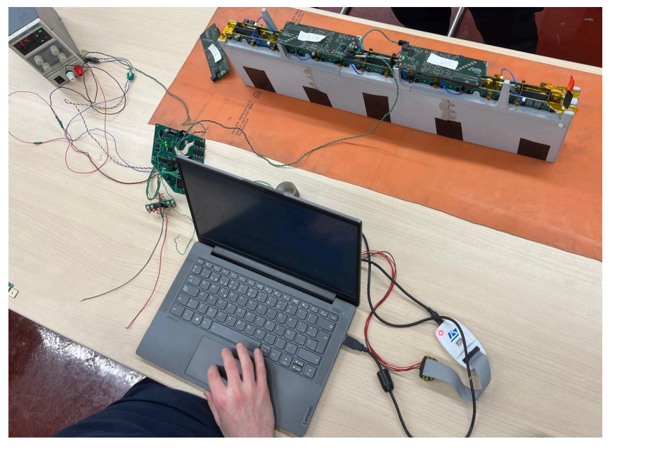
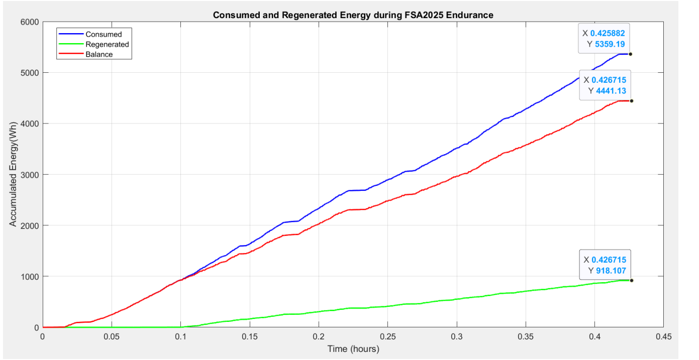
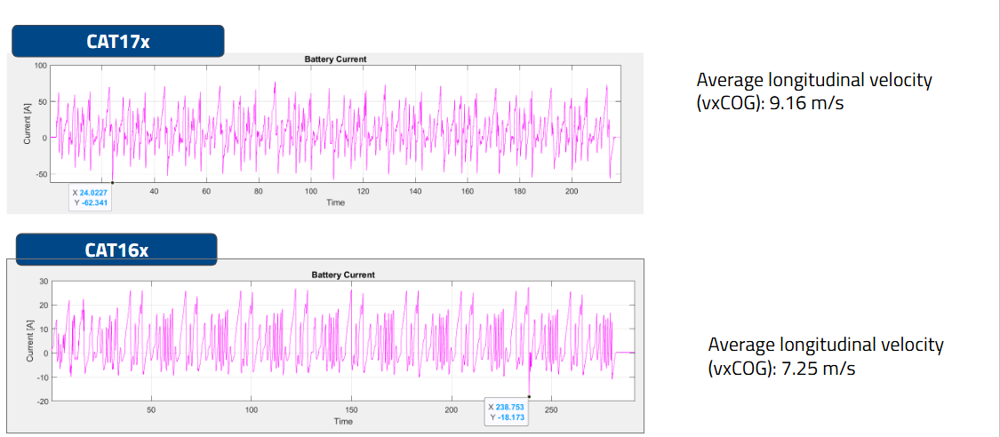

# FS-Regenerative-Battery-Model: Breaking the 7-Year Endurance Curse

## What is Formula Student?
**Formula Student (FS)** is the world’s most prestigious engineering competition for universities. It challenges teams to design, build, and race a formula-style vehicle from scratch. It is not just a race; it is a test of project management, cost efficiency, and cutting-edge engineering.

The **Endurance Event** is the crown jewel: a 22km non-stop race that tests the vehicle's reliability and thermal management to the absolute limit. Finishing an Endurance is the ultimate proof of a car's engineering integrity.

BCN eMotorsport Prototype:

---

## The Strategic Challenge: The Weight-Regen Paradox
Historically, the team carried a heavy **7-8 kWh battery pack** to ensure finishing the race. We couldn't reduce weight because we lacked efficient regeneration, and we couldn't implement regeneration without a reliable BMS.

**My mission:** Break this cycle by proving we could safely push the battery limits to enable future weight reduction.

---

## Technical Pillars of the Project

### 1. Hardware Recovery: Fixing the BMS Foundation
Before software optimization, we needed a stable platform. I performed a deep diagnostic of the legacy **Battery Management System (BMS)**.
* **The Problem:** Signal noise and system crashes during high-current events.
* **The Diagnosis:** Identified critical flaws in the IC supply architecture and incorrect isolation transformer terminations. 
* **The Result:** A robust hardware interface capable of handling high-frequency current spikes during aggressive braking.

### 2. Experimental Validation: The Melasta Challenge
Manufacturer datasheets are often conservative. To reach 20% regeneration, I challenged the **Melasta Li-ion cells** limits.
* **Testbench:** Built a custom testing rack to monitor real-time thermal gradients and internal resistance.
* **The Insight:** Previous track data showed stable temperatures. My tests confirmed that our cooling system could dissipate the heat from higher regen currents safely.
* **Efficiency:** Operating closer to the **600V limit** reduced losses through the Joule Effect:
  $$P_{loss} = I^2 \cdot R$$

### 3. The Predictive Model: Engineering the Future
After the track success, I developed a **Battery Equivalent Circuit Model (ECM)** in MATLAB/Simulink.
* **Verification:** Calibrated using real telemetry from our successful world-class races.
* **Simulation:** The ECM now allows the team to simulate the "Worst Case" Endurance scenario. 
* **Legacy:** Provides the empirical evidence needed to downsize the battery pack for next season's car.

---
## Data Registered in Formula Student Austria:
### 📈 Energy Consumption & Recovery Analysis
The following plot shows the real telemetry data from the **FSA 2025 Endurance Event**.

  

**Key Data Point:** We recovered **918.1 Wh** against a net consumption of **4441.1 Wh**, achieving a real-world regenerative efficiency of **20.6%**. This confirms that the Battery Equivalent Circuit Model (ECM) and the hardware fixes were successful in a high-performance racing environment.

### Track Performance: The "Race Pace" Advantage
The optimization went beyond energy saving. By increasing the regenerative braking ceiling:
1. **Later Braking Points:** Drivers could brake deeper into curves, reducing lap times.
2. **Pedal Confidence:** The increased braking torque provided a more aggressive and predictable deceleration curve.
3. **Thermal Balance:** By shifting more braking work to the motors, we reduced the thermal load on the mechanical friction brakes, maintaining consistent performance throughout the 22km.
---

## Tech Stack
* **Software:** MATLAB / Simulink, Python (Data Analysis).
* **Hardware:** BMS Architecture, High-Voltage Systems, CAN Bus.
* **Methodologies:** Root Cause Analysis (RCA), Experimental Testing, ECM Modeling.

---

## 📂 Documentation
Full technical details, including PCB diagnostics and cell test data, can be found in the [docs](./docs) folder.
